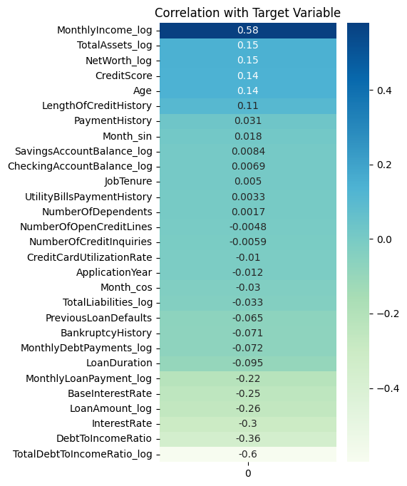
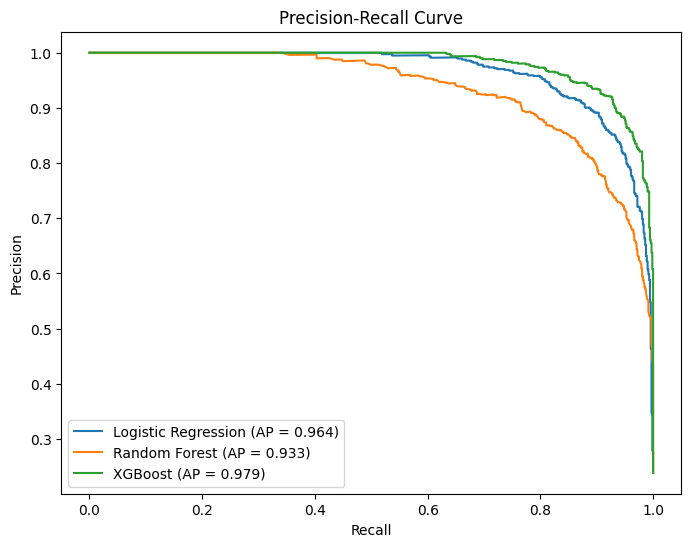
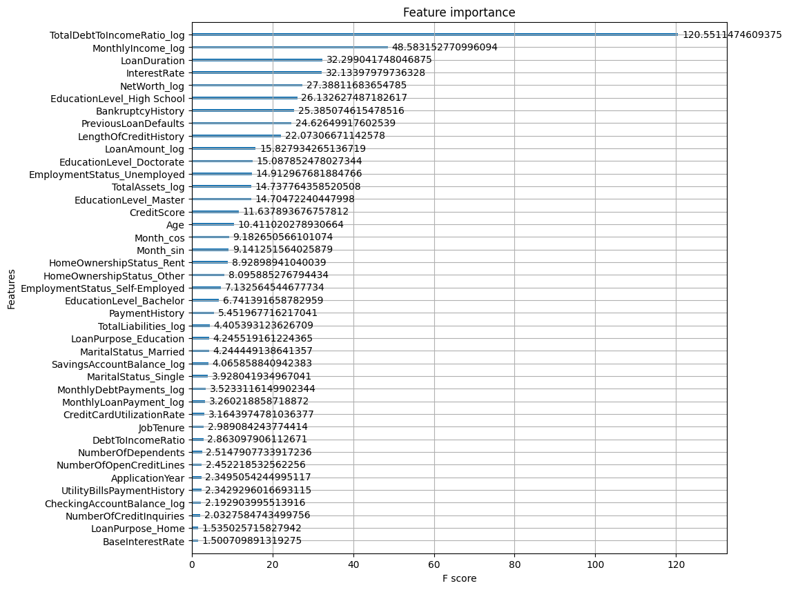

# Financial-Risk-for-Loan-Approval

    

## Business Problem: Optimizing Loan Portfolio Profitability While Minimizing Risk Exposure
**Background:**    
A financial institution wants to grow its loan portfolio by approving more applications without significantly increasing its default risk. Historically, overly cautious approval strategies have led to lost revenue opportunities, while lenient strategies have increased default rates and write-offs.

**Objective:**    
Use predictive modeling to identify applicants who are both likely to repay their loans and profitable to approve, balancing approval rates with financial risk and expected returns.
 

### Folder structure
Financial-Risk-for-Loan-Approval/       
│       
├── data files/  
|
├── figures/                                 
│       
├── notebooks/      
│   |── modular pipeline.ipynb       
│   └── original.ipynb   
│       
├── src/                
│   ├── __init__.py    
│   ├── config.py  
│   ├── data.py     
│   ├── features.py     
│   ├── model_predictions.py       
│   ├── model_training.py        
│   ├── evaluation.py     
│   └── pipeline.py      
│       
├── trained models/     
├── notebooks/      
│   |── notebook models/       
│   └── pipeline models/       
│       
├── app.py 
├── requirements.txt        
├── .env         
├── .gitignore  
└── README.md       

### Key Question to Address:
<!-- ##### Risk Assessment (Regression Task)

1) What is the predicted RiskScore for a new applicant, indicating the likelihood of default?

2) How does this score correlate with key variables like credit history, debt-to-income ratio, or loan purpose? -->

**Loan Approval (Classification Task)** - Should this applicant be approved or denied for a loan based on their financial profile?

<!-- ##### Strategic Decisioning

1) How can we segment applicants (e.g., low-risk/high-value, high-risk/low-value) to refine lending strategies?

2) What threshold on the RiskScore corresponds to optimal approval criteria (balancing profit vs. risk)?

3) Can we dynamically adjust interest rates based on predicted risk and expected loss? -->

## Dataset
The dataset includes the following columns:
| Column Name | Column Description |
| ------------- | ------------- |
| ApplicationDate | Loan application date |
| Age | Applicant's age |
| AnnualIncome | Yearly income |
| CreditScore | Creditworthiness score |
| EmploymentStatus | Job situation |
| EducationLevel | Highest education attained |
| Experience | Work experience |
| LoanAmount | Requested loan size |
| LoanDuration | Loan repayment period |
| MaritalStatus | Applicant's marital state |
| NumberOfDependents | Number of dependents |
| HomeOwnershipStatus | Homeownership type |
| MonthlyDebtPayments | Monthly debt obligations |
| CreditCardUtilizationRate | Credit card usage percentage |
| NumberOfOpenCreditLines | Active credit lines |
| NumberOfCreditInquiries | Credit checks count |
| DebtToIncomeRatio | Debt to income proportion |
| BankruptcyHistory | Bankruptcy records |
| LoanPurpose | Reason for loan |
| PreviousLoanDefaults | Prior loan defaults |
| PaymentHistory | Past payment behavior |
| LengthOfCreditHistory | Credit history duration |
| SavingsAccountBalance | Savings account amount |
| CheckingAccountBalance | Checking account funds |
| TotalAssets | Total owned assets |
| TotalLiabilities | Total owed debts |
| MonthlyIncome | Income per month |
| UtilityBillsPaymentHistory | Utility payment record |
| JobTenure | Job duration |
| NetWorth | Total financial worth |
| BaseInterestRate | Starting interest rate |
| InterestRate | Applied interest rate |
| MonthlyLoanPayment | Monthly loan payment | 
| TotalDebtToIncomeRatio | Total debt against income | 
| LoanApproved | Loan approval status | 
| RiskScore | Risk assessment score | 

## Implementation
**1) Understanding the Dataset (performing inintal analysis)**

- Overall shape of the dataset (20000,36)
- Presence of any null values (no null values)
- Checking the datatypes of the columns (float, int and object)
- Performing EDA (Statistical Analysis and Data Visualization)

**2) Data Cleaning**

- Cleaning the Application Date column (extracting the month and year from the date)
- Truncating the floating point values (rounding to 3 decimal places)
- Checking for consistency in column data
- Feature Engineering (`DebtToIncomeRatio`, `Monthly_LoanToIncomeRatio`)
- Applying **Log Transformation** to columns to stabilize variance. 
- Dropping highly correlated features (based on the following step) and retaining only the log transformed variables.       
[Check the notebook for a detailed reasoning for why specific features were dropped.]

**3) Feature Correlation**

- Checking how much each feature contributed to determining the target column.
- We are creating a correlation matrix with the target variable and then sorting the features by the magnitude of correlation.
- We are using a heatmap color code the features based on the magnitude.
- **Observation**: The following columns play a significant role in determining whether the loan is approved or rejected
    -  (having positive correlation) `MonthlyIncome_log`, `TotalAssets_log`, `NetWorth_log`, `CreditScore`, `Age`, `LengthOfCreditHistory`
    -  (having negative correlation) `TotalDebtToIncomeRatio_log`, `DebtToIncomeRatio`, `InterestRate`, `LoanAmount_log`, `BaseInterestRate`

  

    

**4) Encoding**

- We now convert all the categorical columns to numeric using the **One Hot Encoder**.
- The reason why we don't use **Ordinal Encoding** is to avoid introducing a notion of "order" into features where order is NOT inherently present between the categories.

**5) Train Test Split**

- We split the dataset in a **70:15:15 ratio** to create the Train, Validation and Test datasets.
- We set the random state to 42 and apply stratification to ensure the proportion of approved and rejected records stay the same in all 3 datasets.

**6) Scaling**

- We scale the data to ensure that all records in each column lie in withing similar and comparable range. 
We used standard Scaler to scale the column values, since we had already applied log transformation to the data which stabalized the variance and reduced the severity of the outliers.
We could have also used the **Robust Scaler** to scale the data values (since it is robust to outliers) if the log-transformed data still exhibited extreme values or heavy tails, which was not so in this case.

**7) Balancing the data (approved and rejected loan application records)**

- The Approved-to-Rejected loan applications ratio is nearly 25:75, which is a moderate class imbalance.
- Undersampling would reduce the number of majority-class samples, potentially discarding useful information.
- Oversampling can increase the risk of overfitting by duplicating or synthetically generating minority-class samples.
- Since the imbalance is not severe, we leave the imbalace in the dataset as it is and instead focus on tuning the model parameters to better understand the non-linear relationships in the data.
   
**8) Model Training**

- We have used 3 models - **Logistic Regression, Random Forest Classifier and XG Boost**.
- We first evaluated the model on the validation set and on getting an optimal models (after perfoming hyperparameter tuning), we proceeded to predicting the test data.

**9) Hyperparameter Tuning**

- We have used 2 methods to find the optimal combination of hyperparameters in each model:
    - **Grid Search CV for Logistic Regression**: As it there are few combinations of hyperparameter and this method tests evey possible combination of parameters. Hence, it won't take a long time to run.
    - **Random Search CV for Random Forest and XG Boost**: Since there are more combinations of parameters, testing out every combination would not only be time consuming but also computationally expensive. By using Random Search, we can test just a fraction of the combinations while capturing 95%+ of the potential performance boost.
     
**10) Model Evaluation**

- We used the following evaluation metrics - **Precision, Recall, F1 Score and Confusion Matrix, ROC-AUC, PR-AUC**.
- We have kept aside Accuracy for now, since this metric proves to be very misleading if the data contains imbalanced classes.
- Since the objective is to **identify applicants who are both likely to repay their loans and profitable to approve**, we focus on the **F1-score**, as it provides a balanced measure of precision and recall. 
    - A _high Precision_ ensures that applicants predicted to be approved are likely to repay their loans, reducing the risk of defaults.
    - A _high Recall_ ensures that most creditworthy applicants are identified and approved, minimizing missed lending opportunities. 
    - Therefore, the F1-score is an appropriate metric for balancing loan risk and business profitability.

- Here is a summarized **Model Evaluation and Comparison Table** (Evaluation on the **Validation Dataset** (BEFORE TUNING)):
     | Model | Class Label | Precision | Recall | F1 Score | Accuracy |
     | ------------- | ------------- | ------------- | ------------- | ------------- | ------------- |
     | Logistic Regression (base) | 0    |   0.985  |    0.936  |    0.960 | 0.940
     |   | 1    |   0.824   |   0.954    |  0.884 | |
     | Random Forest (base) | 0    |   0.941  |    0.962  |    0.951 | 0.925 |
     | | 1   |    0.871   |   0.808   |   0.838 | |
     | XG Boost (base) | 0   |    0.971  |    0.972   |   0.972 | 0.957 |
     |  |  1   |    0.912   |   0.908   |   0.910 | |

    We can see that XGBoost identifies approximately 10% more loan application approvals than Logistic Regression while also maintaining higher precision.

- ROC-AUC scores (BEFORE TUNING)
     | Model | ROC-AUC | Average Precision (PR-AUC) |
     | ------------- | ------------- | ------------- | 
     | Logistic Regression (base) |  0.988  |  0.969  | 
     | Random Forest (base) |  0.975  |  0.934  | 
     | XG Boost (base) |  0.992  |  0.976  | 

- Here is a summarized **Model Evaluation and Comparison Table** (Evaluation on the **Validation Dataset** (AFTER TUNING)):
     | Model | Class Label | Precision | Recall | F1 Score | Accuracy |
     | ------------- | ------------- | ------------- | ------------- | ------------- | ------------- |
     | Logistic Regression | 0    |   0.968  |    0.969  |    0.968 | 0.952 |
     |   | 1    |    0.901   |   0.897    |  0.899 | |
     | Random Forest | 0    |   0.942  |    0.963  |    0.952 | 0.926 |
     | | 1   |    0.872   |   0.810   |   0.840 |
     | XG Boost | 0   |    0.973  |    0.975   |   0.974 | 0.960 |
     |  |  1   |    0.919   |   0.914   |   0.916 | |

- ROC-AUC scores (AFTER TUNING)
     | Model | ROC-AUC | Average Precision (PR-AUC) | Best Model Parameters |
     | ------------- | ------------- | ------------- | ------------- |
     | Logistic Regression |  0.988  |  0.969  | {'model__C': 10, 'model__class_weight': None, 'model__solver': 'liblinear'} |
     | Random Forest |  0.976  |  0.936  | {'model__n_estimators': 200, 'model__min_samples_split': 2, 'model__min_samples_leaf': 1, 'model__max_features': 'sqrt', 'model__max_depth': None} |
     | XG Boost |  0.993  |  0.980  | {'model__subsample': 1.0, 'model__n_estimators': 300, 'model__max_depth': 3, 'model__learning_rate': 0.1, 'model__colsample_bytree': 1.0} |

    We can see the improvement in the model perfromance on Logistic Regression and XG Boost models upon performing hyperparameter tuning. However, the performance of Random Forest seems to remain unchanged.  
    A possible reason to this may be that the RandomizedSearchCV only sampled a fraction of the grid (i.e., 15 out of 162 combinations), and hence, it may have missed to test the perfect combination of parameters.

- Here is a summarized **Model Evaluation and Comparison Table** (Evaluation on the **Test** Dataset):
     | Model | Class Label | Precision | Recall | F1 Score |
     | ------------- | ------------- | ------------- | ------------- | ------------- |
     | Logistic Regression | 0    |   0.980  |    0.943  |    0.961 |
     |   | 1    |   0.837   |   0.937    |  0.884 |
     | Random Forest | 0    |   0.934  |    0.968  |    0.951 |
     | | 1   |    0.885   |   0.782   |   0.830 |
     | XG Boost | 0   |    0.968  |    0.981   |   0.975 |
     |  |  1   |    0.936   |   0.898   |   0.917 |

- ROC-AUC and PR-AUC Scores of the Models:
     | Model | RUC-AUC | Average Precision (PR-AUC) |
     | ------------- | ------------- | ------------- |
     | Logistic Regression | 0.986 | 0.964 |
     | Random Forest | 0.976 | 0.933 |
     | XG Boost | 0.993 | 0.979 |

 

    
    

## Inference
   - We can rank the overall performance of the models in the following order:      
   **XG Boost > Logistic Regression > Random Forest Classifier**
   - Hence, **XG Boost** is our best performing model across all the evaluation metrics.

   Here is the **Feature Importance** Extracted from the trained XG Boost Model:

    

- The feature importance extracted from the trained XGBoost model indicates that `TotalDebtToIncomeRatio_log` is the most influential feature in distinguishing between approved and rejected loan applications. Other important predictors include `MonthlyIncome_log`, `Loan Duration` and `Interest Rate`, all of which contribute significantly to the model's classification decisions.

- Features like `TotalDebtToIncomeRatio_log`, `MonthlyIncome_log`, `InterestRate` and `NetWorth_log` consistently emerged as key predictors in both the correlation analysis with the target variable conducted during data preprocessing and the feature importance analysis of the trained XGBoost model.

### Potential Next Steps

- **Feature Pruning:** 
    Since we have a lot of features that don't contribute significantly towards the classification performance, we could possibly remove the bottom 5 to 10 features without seeing a major drop in the validation or test performances. This would make out model lighter, faster to train and less prone to overfitting.

- **SHAP:** 
    we know `TotalDebtToIncomeRatio_log` is important, but it doesn't tell you how it affects the decision making. That is, does the value of TotalDebtToIncomeRatio_log positively or negatively influence the loan application approval (higher the value, higher the probability of loan approval OR lower the value and higher the probability of loan approval)? Hence, we need to run a SHAP (SHapley Additive exPlanations) analysis on the XG Boost model.